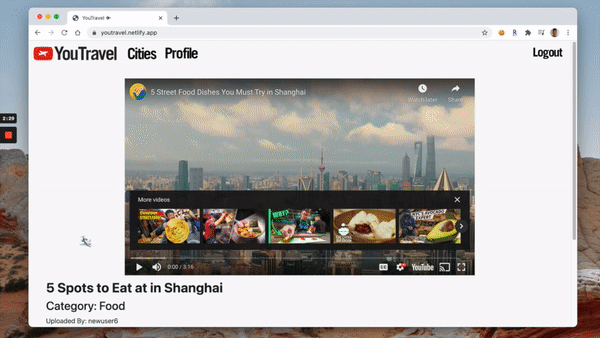

`YouTravel`is a single-page application (SPA) video platform for travelers to share and discover videos from cities across the world. Inspired by [YouTube](https://www.youtube.com/).

Requires [YouTravel front end](https://github.com/jeffreyc86/youtravel-frontend) and [YouTravel back end](https://github.com/jeffreyc86/youtravel-backend).

Created in partnership with Flatiron School cohort-mate [Jacob Marthaller](https://github.com/jmarthaller).

## Live Link & Demo

Visit the [Live Link](https://youtravel.netlify.app/)

Watch the [Demo](https://www.loom.com/share/7fd0bb35571a4eb8bfdef9d2c4ea1c3e)

## Technologies Used

The front end is built with vanilla `Javascript` and the back end is built using `Ruby on Rails` and `PostgreSQL`. Styling includes contributions from the [Bootstrap](https://getbootstrap.com/) library, as well as custom HTML & CSS. The live link for `YouTravel` is deployed on [Netlify](https://www.netlify.com/) with [Heroku](https://www.heroku.com/) for the back end.

`YouTravel` relies on gifs, videos sourced from YouTube, and other imagery to guide users through the application.

## Features
`YouTravel` allows users to watch videos containing information, tips, and tricks about how & where to travel within various global cities. 

### User Profile

Users can sign up or login to access their YouTravel account. Both creating an account and logging in have validations. 

Upon a successful login, a user will be taken to their profile page, which contains videos that user has uploaded.

### Cities

When a user clicks on the `Cities` tab, they will be brought to the main cities page. When hovering over an image of a city, the static image will animate.

### City Pages

Once a user selects a city, they are brought to the city's main page. This page contains a short description for the city as well as the travel-related videos by category - Food, Leisure, Cultural, Nightlife, and Walking Tour.

### Video Pages

Clicking on a particular video thumbnail takes the user to the video's page. This page includes the video itself, as well as current comments and likes. Users can play the video, like the video, and add a comment.

Comments posted by the user may also be edited and deleted.

### Uploading Videos

On the profile page, there is an upload video button. When clicked, a form appears where the user may go through the prompts and upload a video using a YouTube watch url. Once uploaded, the user is brought to the video's page.

On the video's page, the user also has the ability to delete the video.

### Logging Out

Being that YouTravel is a single page application, when a user clicks on the `Logout` tab, the window refreshes. This effectively logs out the current user's session and brings them back to the home page.

## License

The [MIT](https://choosealicense.com/licenses/mit/) License

Copyright (C) 2021 - [Jeffrey Chiu](https://github.com/jeffreyc86) and [Jacob Marthaller](https://github.com/jmarthaller)